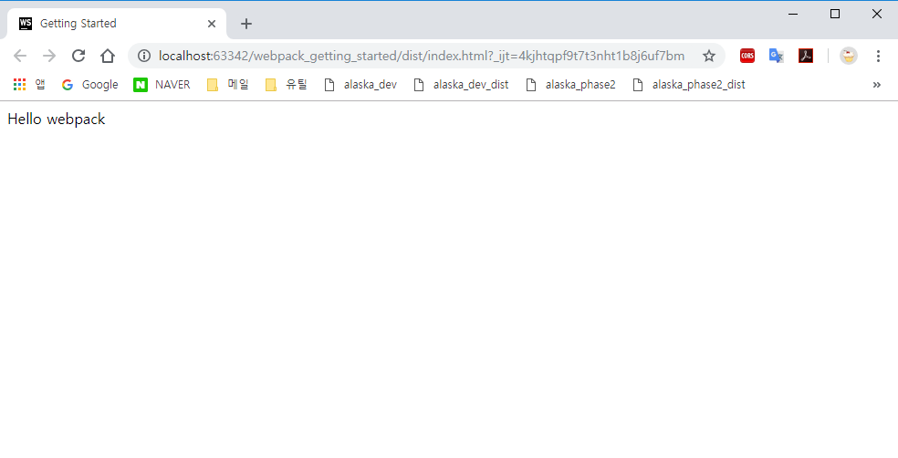

# webpack tutorial
webpack을 처음 시작하는 튜토리얼입니다. lodash를 패키징 합니다.
[공식 홈페이지 참고](https://webpack.js.org/guides/getting-started/)

#### 1. nodejs 설치
[nodejs LTS 버전 설치](https://nodejs.org/ko/)

#### 2. npm install
```angular2
npm install 
```

### 3. npx webpack
```
npx webpack
```




## Details
[Getting Started webpack](https://github.com/KimHyeshin/TIL/blob/master/front-end/webpack/getting-started-webpack-v1.md)
